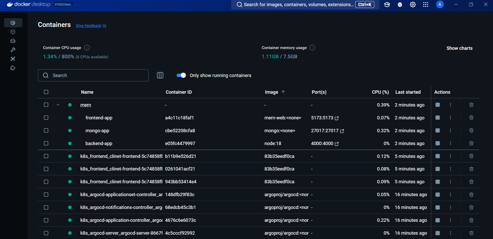
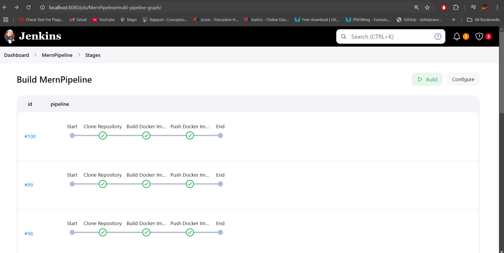
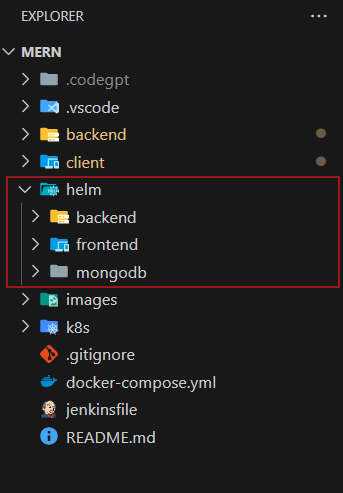
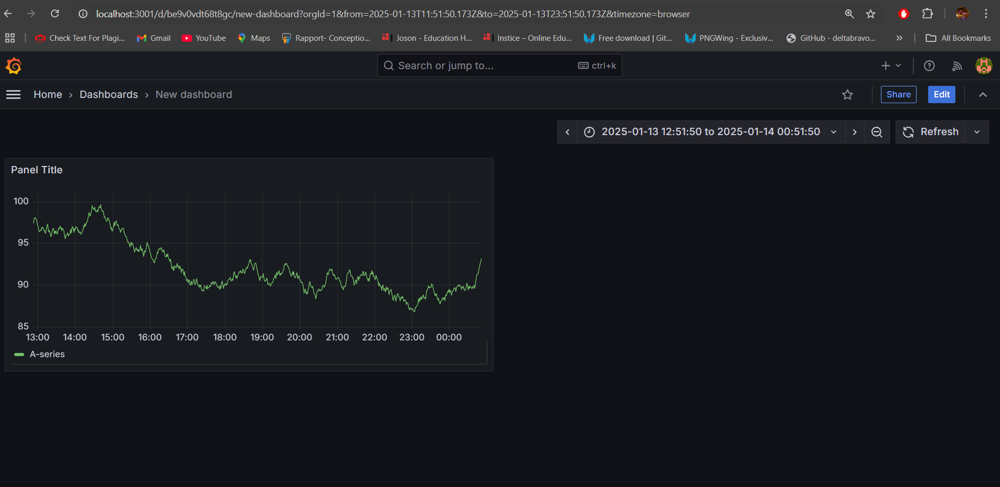

# DevOps Deployment Guide

## **1. Creation of Dockerfiles**

### Backend 

Create a `Dockerfile` in the backend folder containing the necessary instructions to containerize the backend component.

### **Frontend (Client)**

Create a `Dockerfile` in the `client` folder containing the necessary instructions to containerize the frontend component.

Each file should define the steps required to build and run their respective components in a Docker container.

---

## **2. Configuration with Docker Compose**

Create a `docker-compose.yml` file at the root of the project to orchestrate the backend and frontend containers.

Ensure that the services are configured to communicate with each other correctly.

```bash
docker-compose up --build
```

---



```bash
http://localhost:5173/
```


## **3. Setting Up CI with Jenkins**

### **CI Pipeline**

Create a `Jenkinsfile` with the following stages:

1. **Start**: Initialize the pipeline.
2. **Checkout SCM**: Retrieve the source code from the repository.
3. **Build Server Image**: Build the Docker image for the backend (API).
4. **Build Client Image**: Build the Docker image for the frontend (Client).
5. **Push Images to Docker Hub**: Push the built images to Docker Hub.
6. **End**: Complete the pipeline.



---

## **4. Setting Up CD with Kubernetes**

### **Basic Manifests**

Create the following manifest files in the k8s folder:

- `backend-deployment.yaml`: Deployment for the backend .
- `backend-service.yaml`: Service exposing the backend with a NodePort.
- `frontend-deployment.yaml`: Deployment for the frontend .
- `frontend-service.yaml`: Service exposing the frontend with a NodePort.
- `mongo-deployment.yaml`: Deployment for the database .
- `mongo-service.yaml`: Service exposing the mongo with a NodePort.
- `app-configmap.yaml`: storing configuration data as key-value

**Local Deployment**

Apply the manifests in the local Kubernetes cluster:

```bash
cd k8s
kubectl apply -f app-configmap.yaml
kubectl apply -f backend-deployment.yaml
kubectl apply -f backend-service.yaml
kubectl apply -f frontend-service.yaml
kubectl apply -f frontend-deployment.yaml
kubectl apply -f mongo-deployment.yaml
kubectl apply -f mongo-service.yaml
```

Verify that the service is accessible via the NodePort address.


---

## **5. Deployment with Helm and ArgoCD**

### **Helm Charts**

Create Helm charts for each component in the `helm` folder to simplify and standardize deployments.

```bash
mkdir helm
cd helm
helm create backend
helm create frontend
helm create mongodb
```



### **ArgoCD Integration**

1. Configure ArgoCD to monitor the Helm charts.
2. Use the ArgoCD dashboard to manage and synchronize deployments.


### **Verification**

Ensure that the applications are marked as **Healthy** and **Synced** in the ArgoCD interface.

---

## **6. Monitoring**

### **Grafana Dashboard**


